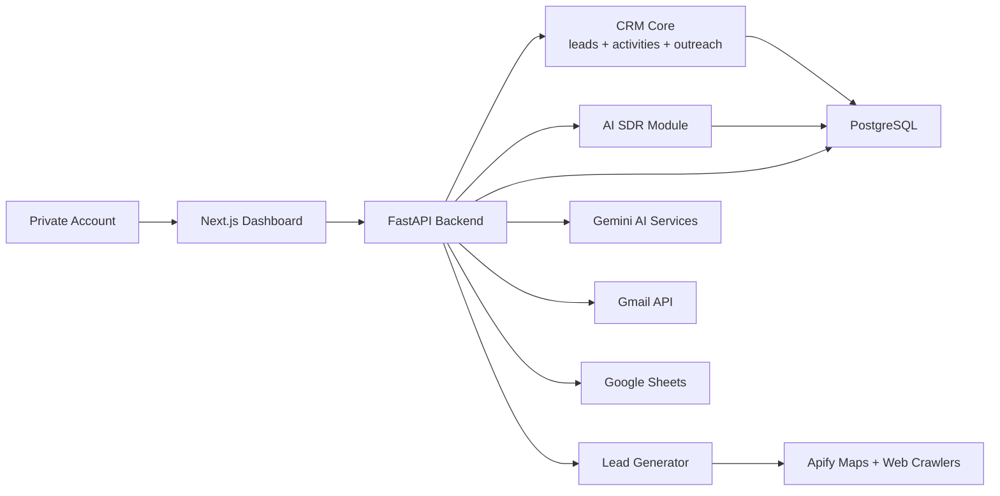
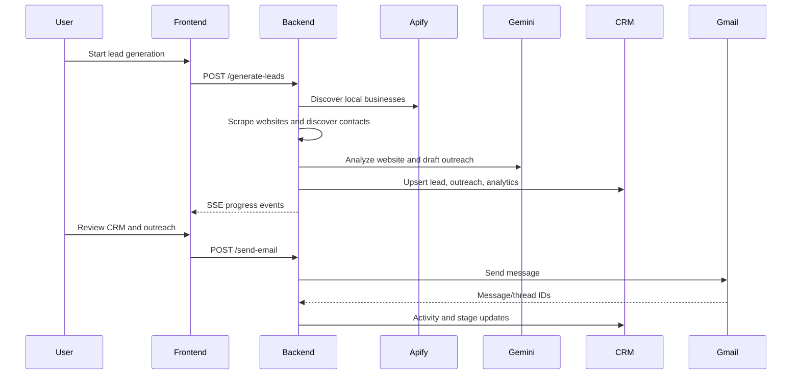
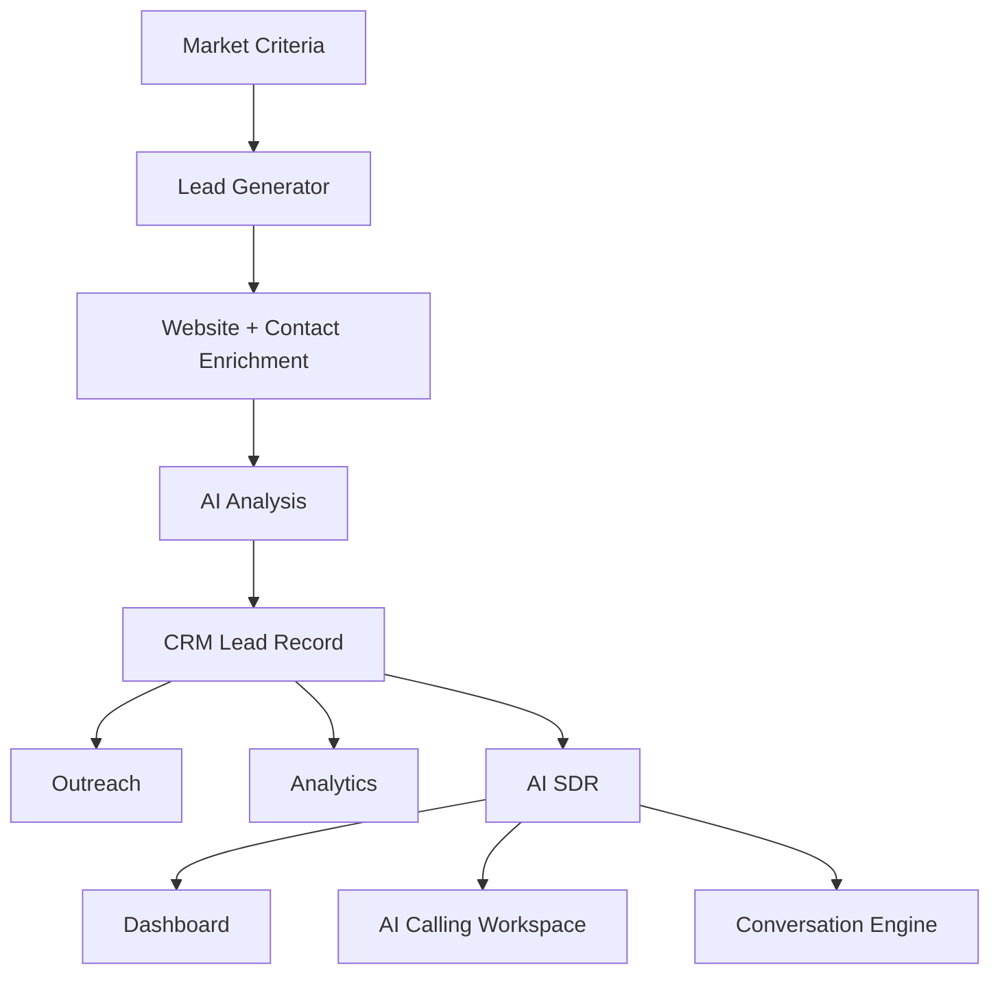
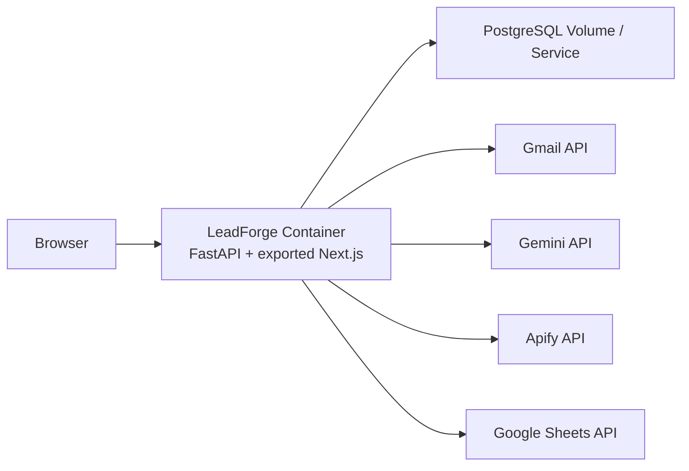

# LeadForge AI Platform

> Enterprise-grade AI lead generation, CRM, outreach, and AI SDR workspace for growth teams.

<p align="center">
  <strong>[ LeadForge AI Logo Placeholder ]</strong><br />
  <em>Replace this text with the final product logo or wordmark before public launch.</em>
</p>

LeadForge AI Platform is a full-stack SaaS system that turns local-market discovery into an actionable sales pipeline. It combines automated lead discovery, AI website analysis, CRM operations, Gmail outreach, analytics, and an independent AI SDR module with production AI calling and a conversation engine. Each registered account owns one completely private workspace; there are no organizations, teams, invitations, or shared workspaces.

The platform is designed for judges, developers, investors, customers, and future contributors who need to understand not only what LeadForge does, but why the architecture exists and how the pieces fit together.

## Problem Statement

Small and mid-market businesses need predictable revenue, but the work required to find prospects, inspect websites, identify opportunities, enrich contact data, draft outreach, track replies, and follow up consistently is fragmented across many tools. Teams lose time switching between scrapers, spreadsheets, CRMs, email clients, and AI assistants.

## Industry Challenges

| Challenge | Impact |
|---|---|
| Fragmented lead operations | Teams lose context between prospecting, CRM, outreach, and analytics. |
| Manual qualification | Sales reps spend time on low-quality leads instead of high-intent opportunities. |
| Weak website insight | Outreach often lacks specific business context and sounds generic. |
| Slow follow-up | Interested prospects go cold when replies are not tracked or routed. |
| Data quality drift | Duplicate contacts, inconsistent fields, and spreadsheet exports create unreliable CRM data. |
| AI trust gap | AI sales tools must be transparent, controllable, and operationally auditable. |

## Solution

LeadForge AI is a single operating console for finding, qualifying, storing, and activating leads. It uses automation to discover businesses, AI to evaluate websites and generate outreach, CRM workflows to manage lifecycle state, and an independent AI SDR architecture to normalize contacts and conduct future sales conversations.

## Vision

Build the AI-native revenue operating system for small teams: one platform where lead discovery, CRM, outreach, analytics, and AI SDR workflows are connected by shared data and explainable automation.

## Mission

Help growth teams convert raw market opportunity into qualified pipeline faster, with less manual work and more trustworthy customer context.

## Architecture Overview

LeadForge is a modular monolith with clear internal boundaries:

- **Frontend**: Next.js 15 App Router, React 19, TypeScript, Tailwind CSS, shadcn/ui, Recharts, Framer Motion.
- **Backend**: FastAPI, SQLAlchemy 2, Alembic, PostgreSQL, server-sent events for generation jobs.
- **Authentication**: JWT access cookies, persisted refresh tokens, email/password auth, Google OAuth, GitHub OAuth, password reset tokens, CSRF protection, and login rate limiting.
- **AI**: Gemini for website analysis and outreach drafting; independent AI SDR conversation engine for future voice/chat SDR flows.
- **Integrations**: Apify, Google Sheets, Gmail OAuth, PostgreSQL.
- **CRM Core**: Central shared record system for all contacts, pipeline stages, notes, tags, activities, and messages.



## Platform Features

- AI-powered lead generation from geographic and industry criteria.
- Website scraping and opportunity analysis.
- Contact discovery, confidence scoring, and validation.
- CRM kanban/table views with stages, notes, tags, activities, and Gmail messages.
- AI-generated outreach drafts and follow-ups.
- Gmail sending, open tracking, reply sync, and auto-reply.
- Analytics for lead generation, outreach, conversion, and activity trends.
- Independent AI SDR module with contact ingestion from CSV, Excel, Google Sheets, Manual Entry, REST API, CRM, and future integrations.
- AI SDR dashboard with filters, bulk actions, export, and detailed profiles.
- Full-screen AI Calling Workspace with per-user Twilio connection, Gemini 2.5 Flash, Cartesia voice settings, live transcript streaming, AI Brain state, and mock fallback.
- AI SDR conversation engine with memory, state machine, qualification, objections, closing, and structured events.
- Docker-first deployment with Railway/Netlify guidance.

## Authentication and Privacy

LeadForge uses a simple SaaS account model:

- One registered account equals one private workspace.
- Every user-owned table includes `user_id`.
- API queries filter by the authenticated user automatically.
- Users cannot invite, share, join teams, or access another user workspace.
- Admin status is assigned only when the logged-in email matches `ADMIN_EMAIL`.

Supported sign-in methods are email/password, Google OAuth, and GitHub OAuth. Refresh tokens are stored server-side, auth cookies are HttpOnly, and unsafe API writes require CSRF validation.

## User-Owned Calling

AI SDR calling is scoped to the signed-in account. Users connect their own Twilio account in Settings -> Voice, select an available Twilio number, and optionally store their Cartesia voice preferences and API key. Twilio auth tokens and Cartesia keys are encrypted in PostgreSQL, and calls use the authenticated user's connection instead of a shared platform Twilio account.

## Modules

| Module | Purpose |
|---|---|
| Lead Generator | Discovers businesses, scrapes websites, analyzes opportunities, and stores leads. |
| CRM | Central operational system for lead lifecycle, ownership, notes, tags, activities, and emails. |
| Outreach | Generates and sends personalized email outreach and tracks replies. |
| Analytics | Aggregates pipeline, generation, and outreach performance. |
| AI SDR | Independent SDR architecture for normalized contact ingestion, dashboarding, mock calls, and conversation logic. |
| Integrations | Apify, Google Sheets, Gmail, Gemini, PostgreSQL, and future connectors. |
| Shared Services | Database, configuration, schemas, settings store, and shared UI primitives. |

## Technology Stack

| Layer | Technology |
|---|---|
| Frontend | Next.js 15, React 19, TypeScript, Tailwind CSS, shadcn/ui |
| Backend | FastAPI, Pydantic 2, SQLAlchemy 2, Alembic |
| Database | PostgreSQL 16, SQLite for tests |
| AI | Google Gemini via `google-genai`; Anthropic dependency retained for future/legacy extraction paths |
| Crawling | Apify Google Maps and website crawlers, BeautifulSoup, Playwright |
| Email | Gmail OAuth, Gmail API, tracking pixel |
| Deployment | Docker, Docker Compose, Railway, Netlify static frontend option |
| Testing | Pytest, unittest, ESLint, Next production build |

## System Workflow



## High-Level Diagram



## Deployment Diagram



## AI Architecture

LeadForge uses AI in controlled operational boundaries:

- **Website Analysis**: Gemini converts scraped content into summaries, problems, suggestions, and opportunity scores.
- **Outreach Drafting**: Gemini generates personalized cold email and follow-up variants from lead and website context.
- **AI SDR Conversation Engine**: deterministic state machine and memory layer create natural SDR responses and structured events. It does not currently call an LLM or telephony provider.
- **Future Voice AI**: the AI Calling Workspace and conversation engine are ready for a future Twilio/voice transport layer.

## Database Overview

CRM-centered relational design:

- `leads` is the central contact/company table.
- `campaigns` groups generated leads.
- `outreach` stores generated email drafts and sending state.
- `crm_users`, `crm_tags`, `lead_tags`, `lead_notes`, and `lead_activities` power CRM operations.
- `email_messages` stores Gmail threads and synced messages.
- `analytics` records platform events.
- `settings` stores runtime configuration overrides.
- `lead_generation_jobs` tracks background generation runs.
- `ai_sdr_contact_batches` and `ai_sdr_contact_records` store AI SDR ingestion metadata.

See [docs/DATABASE.md](docs/DATABASE.md).

## Screenshots

| Screen | Description |
|---|---|
| Dashboard | `design/crm-kanban-concept.png` can be replaced with final dashboard capture. |
| CRM Detail | `design/crm-detail-concept.png` can be replaced with final CRM profile capture. |
| AI SDR Dashboard | Add a final screenshot of `/ai-sdr`. |
| AI Calling Workspace | Add a final screenshot of `/ai-sdr/call?contactId=<id>`. |

## Installation

### Prerequisites

- Python 3.12
- Node.js 20+
- PostgreSQL 16 or Docker
- Apify token
- Gemini API key
- Optional Google Sheets and Gmail OAuth credentials

### Local Backend

```powershell
cd backend
python -m venv .venv
.\.venv\Scripts\Activate.ps1
pip install -r requirements.txt
python -m playwright install chromium
python -m uvicorn app.main:app --reload --host 0.0.0.0 --port 8000
```

### Local Frontend

```powershell
cd frontend
npm install
npm run dev
```

Open [http://localhost:3000](http://localhost:3000).

## Configuration

Copy `.env.example` to `.env` and fill in deployment-specific values.

```powershell
Copy-Item .env.example .env
```

Runtime settings can also be saved through the Settings page and persisted in PostgreSQL.

## Environment Variables

Key variables:

- `DATABASE_URL`
- `JWT_SECRET_KEY`
- `ADMIN_EMAIL`
- `ADMIN_PASSWORD`
- `AUTH_COOKIE_SECURE`
- `GOOGLE_OAUTH_CLIENT_ID`
- `GOOGLE_OAUTH_CLIENT_SECRET`
- `GITHUB_OAUTH_CLIENT_ID`
- `GITHUB_OAUTH_CLIENT_SECRET`
- `APIFY_API_TOKEN`
- `GEMINI_API_KEY`
- `GOOGLE_SHEETS_SPREADSHEET_ID`
- `GOOGLE_SERVICE_ACCOUNT_JSON`
- `GMAIL_CLIENT_ID`
- `GMAIL_CLIENT_SECRET`

See [docs/ENVIRONMENT.md](docs/ENVIRONMENT.md).

## Docker Deployment

```powershell
docker compose up -d --build
docker compose ps
```

The container runs Alembic migrations before starting the API and serves the exported frontend from FastAPI in production.

## Railway Deployment

1. Create a Railway PostgreSQL service.
2. Deploy the repository root Dockerfile.
3. Configure environment variables from `.env.example`.
4. Set `APP_URL`, `FRONTEND_ORIGIN`, and `PUBLIC_BACKEND_URL` to the public HTTPS URL.
5. Store `GOOGLE_SERVICE_ACCOUNT_JSON` as a single-line JSON environment variable.
6. Set `AUTH_COOKIE_SECURE=true` for HTTPS deployments.
7. In the Gmail OAuth client, add `https://your-railway-domain/gmail/callback` as an authorized redirect URI.

## Netlify Deployment

LeadForge can use Netlify for a frontend-only deployment when the FastAPI backend is hosted separately:

1. Set `NEXT_PUBLIC_API_URL` to the backend URL.
2. Build from `frontend/`.
3. Publish the static export.
4. Configure backend CORS `FRONTEND_ORIGIN` to the Netlify URL.

## Production Checklist

- [ ] Use HTTPS-only public URLs.
- [ ] Set strong `POSTGRES_PASSWORD`, `JWT_SECRET_KEY`, and `ADMIN_PASSWORD`.
- [ ] Set `ADMIN_EMAIL` to the only admin account email.
- [ ] Configure Google/GitHub OAuth redirect URLs or leave those buttons disabled by omitting OAuth credentials.
- [ ] Store API keys in platform secrets, never in source control.
- [ ] Run `alembic upgrade head`.
- [ ] Verify `GET /health/ready`.
- [ ] Configure Google Sheets sharing with the service account.
- [ ] Verify each signed-in user can connect Gmail from Settings -> Email Integration.
- [ ] Configure log retention and database backups.
- [ ] Keep `WEB_CONCURRENCY=1` until background jobs move to an external queue.
- [ ] Test lead generation, CRM updates, email send, and AI SDR dashboard.

## Folder Structure

```text
Lead generation/
  backend/
    app/                 FastAPI app, CRM, models, schemas, services
    ai_sdr/              Independent AI SDR module
    lead_automation/     Lead discovery and enrichment automation
    migrations/          Alembic migrations
    tests/               Backend test suite
  frontend/
    src/app/             Next.js app routes
    src/components/      Shared UI and CRM components
    src/lib/             Frontend API client and types
    ai_sdr/              Independent AI SDR frontend module
  database/              SQL schema reference
  docs/                  Platform documentation
    templates/           Reusable document and skill templates
  legacy/                Archived compatibility code kept out of runtime paths
  local/                 Ignored local runtime output, secrets, logs, and caches
  scripts/               Development utilities
  design/                Design concepts and screenshot placeholders
  work/                  Ignored generated document artifacts and scratch builds
```

## API Overview

Primary API groups:

- Health: `/health`, `/health/ready`, `/health/google`
- Auth: `/auth/signup`, `/auth/login`, `/auth/refresh`, `/auth/logout`, `/auth/me`, `/auth/forgot-password`, `/auth/reset-password`
- Lead generation: `/generate-leads`, `/generate-leads/{job_id}/events`
- Leads: `/get-leads`, `/get-leads/export.csv`
- Campaigns: `/get-campaigns`
- Outreach: `/outreach`, `/send-email`
- CRM: `/crm/leads`, `/crm/users`
- AI SDR: `/ai-sdr/*`

See [docs/API_REFERENCE.md](docs/API_REFERENCE.md).

## License

This repository does not currently include a formal license file. Add a license before public distribution or hackathon publication.

## Contribution Guide

1. Read [docs/DEVELOPER_GUIDE.md](docs/DEVELOPER_GUIDE.md).
2. Keep module boundaries intact.
3. Add or update tests for backend behavior.
4. Run backend tests and frontend lint/build.
5. Document new endpoints, tables, environment variables, and workflows.

## Future Roadmap

- External job queue and shared event bus for multi-replica scaling.
- Persistent AI SDR conversation sessions.
- Distributed call-session storage for multi-worker AI SDR voice deployments.
- Subscription plans for private accounts.
- Billing and subscription management.
- More import adapters for AI SDR sources.
- Advanced analytics dashboards and forecasting.
- Observability with metrics, tracing, and alerting.

## FAQ

**Is LeadForge only a lead scraper?**
No. Lead generation is one module. CRM, outreach, analytics, AI SDR ingestion, AI calling, and conversation orchestration all operate around the shared CRM.

**Does AI SDR place calls today?**
Yes. AI SDR has a provider-based calling stack for Twilio telephony, Gemini 2.5 Flash reasoning, and Cartesia speech, plus mock mode for local testing.

**Where is the source of truth for contacts?**
The `leads` table in the CRM is the central contact and company record.

**Can the frontend be hosted separately?**
Yes. Set `NEXT_PUBLIC_API_URL` and configure backend CORS.

**Why is `WEB_CONCURRENCY=1` recommended?**
Generation jobs and SSE state are currently in process. Multi-worker scaling requires an external queue/event transport.

## Acknowledgements

LeadForge integrates with and builds on FastAPI, Next.js, PostgreSQL, SQLAlchemy, Alembic, shadcn/ui, Apify, Google APIs, Gmail, and Gemini.

## Credits

Created by the LeadForge team for AI-native sales operations and hackathon demonstration.
