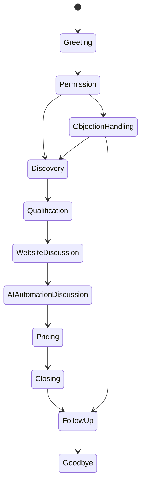

# AI Architecture

## Overview

LeadForge uses AI to reduce manual sales research and communication work while keeping CRM state and user actions auditable.

AI is used in three areas:

1. Website analysis.
2. Email outreach generation.
3. AI SDR conversation and calling orchestration.

## Gemini

Gemini is the primary model provider configured by:

- `GEMINI_API_KEY`
- `GEMINI_MODEL`

The default model is `gemini-2.5-flash`, chosen for low latency and cost-aware generation.

## Prompt Engineering

Prompts are grounded in:

- Business name.
- Website content.
- Contact fields.
- Industry.
- Website problems.
- Opportunity score.
- Improvement suggestions.

Prompt goals:

- Make outputs specific.
- Avoid generic outreach.
- Keep copy concise.
- Return structured analysis usable by the CRM.

## Lead Analysis

Lead analysis reads scraped website content and produces:

- `website_score`
- `opportunity_score`
- `website_summary`
- `website_problems`
- `improvement_suggestions`

This context is stored on the `leads` table and reused by outreach and CRM views.

## Email Generation

Email generation creates:

- Subject line.
- Personalized first line.
- Cold email.
- Follow-up 1.
- Follow-up 2.

Drafts are stored in `outreach` and are not sent automatically unless a user triggers `/send-email`.

## Conversation Memory

The AI SDR conversation engine keeps in-memory session state:

- Transcript events.
- Discovered needs.
- Objections.
- Qualification notes.
- Referenced topics.
- Current state.

## AI SDR

AI SDR has two AI paths:

- The conversation engine uses deterministic strategy modules for predictable text-mode demos.
- The production calling stack uses Gemini 2.5 Flash for live call reasoning and end-of-call summaries.

Modules:

- `sales_strategy.py`
- `objection_handler.py`
- `qualification.py`
- `closing_strategy.py`
- `memory_manager.py`
- `conversation_manager.py`

## Voice AI

Voice AI is integrated behind provider interfaces:

- `TelephonyProvider`: Twilio outbound calls and Media Streams.
- `LLMProvider`: Gemini 2.5 Flash reasoning and structured summaries.
- `SpeechProvider`: Cartesia streaming STT/TTS and silence checks.

The runtime supports:

- Outbound calls.
- Streaming recognition.
- Synthesized AI speech.
- Interruptions.
- Silence detection.
- Call ending.
- Transcript storage.
- CRM outcome updates.

Provider implementations live under `backend/ai_sdr/calling/providers`. Replacing Twilio, Gemini, or Cartesia requires implementing the matching interface without changing the orchestrator.

## Model Selection

Recommended model strategy:

| Use Case | Model Type |
|---|---|
| Website summarization | Fast general model |
| Outreach drafting | Higher-quality generation model |
| Real-time voice SDR | Low-latency conversational model |
| Batch enrichment | Cost-optimized model |

## Cost Optimization

- Limit pages scraped per website.
- Cache website analysis.
- Reuse stored analysis for outreach regeneration.
- Avoid LLM calls for deterministic state transitions.
- Batch background work where possible.

## Safety and Transparency

If a customer asks "Are you AI?", the AI SDR replies honestly. Future voice integration must preserve this behavior.
