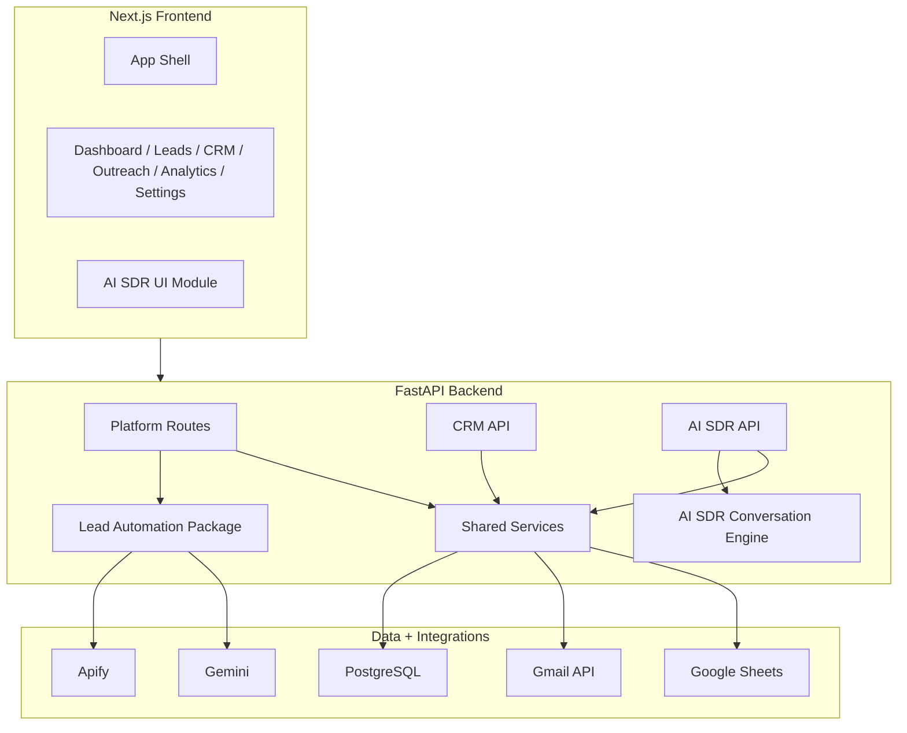
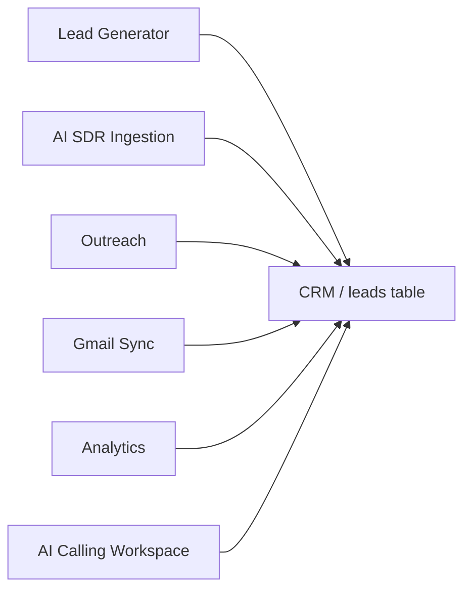
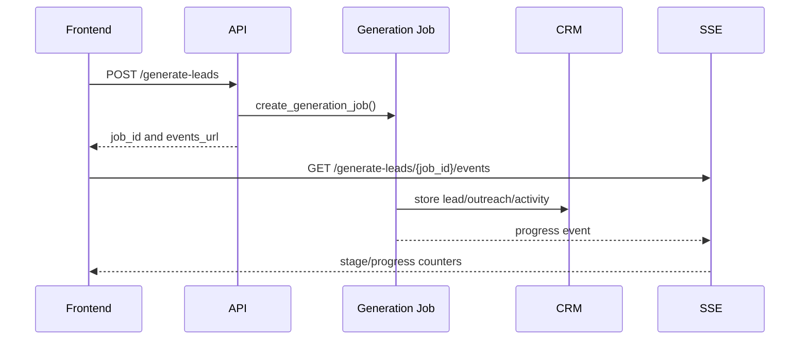
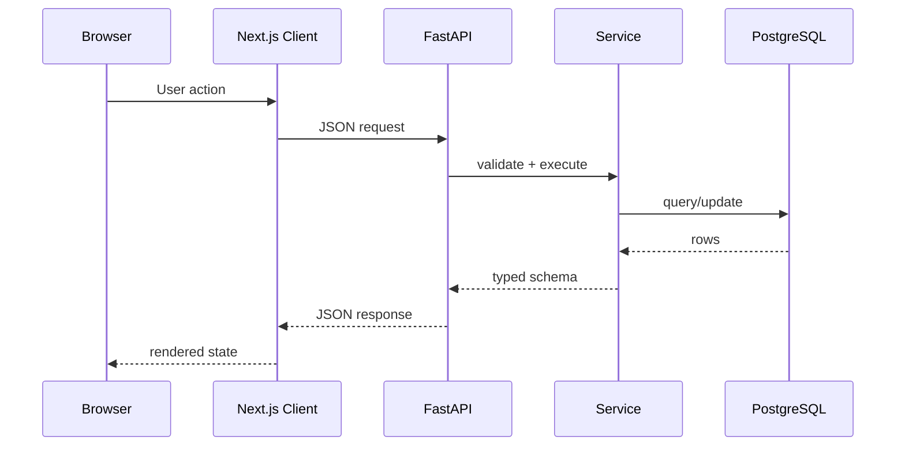
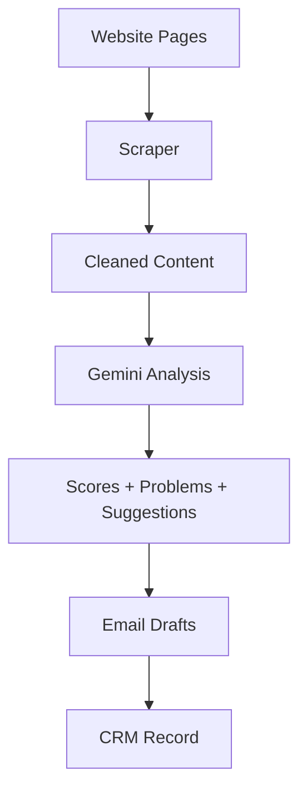
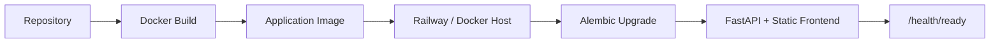

# LeadForge AI Platform Architecture

## System Architecture

LeadForge AI Platform is a modular monolith. It deploys as one application container in the production Docker path, but the codebase is intentionally split into bounded internal modules:

- `backend/app`: platform API, CRM, orchestration, models, settings, Gmail, Google Sheets, analytics, and shared services.
- `backend/lead_automation`: discovery, scraping, enrichment, confidence, validation, and source automation.
- `backend/ai_sdr`: independent AI SDR module with its own API, services, models, schemas, dashboard data, contact ingestion, calling workspace support, and conversation engine.
- `frontend/src`: shared LeadForge application shell, pages, CRM components, and API clients.
- `frontend/ai_sdr`: independent AI SDR frontend module.

The architecture is intentionally pragmatic: a single deployable unit for hackathon speed and operational simplicity, with module boundaries strong enough to evolve into services later.

## Microservice Philosophy

LeadForge follows a "modular first, service later" strategy.

Why:

- The product is still evolving quickly.
- Shared CRM data is central to every workflow.
- A single backend simplifies local development, tests, migrations, and hackathon deployment.
- Clear package boundaries allow future extraction without premature distributed-system complexity.

If LeadForge scales into multiple services, the likely extraction order is:

1. Lead generation worker service.
2. Email/Gmail sync worker service.
3. AI SDR conversation/voice service.
4. Analytics and reporting service.

## Module Independence

Modules are separated by import boundaries and ownership:

- AI SDR does not import from lead generation services.
- Lead generation writes to shared CRM tables through backend services.
- CRM owns the customer record lifecycle.
- Shared utilities are limited to database, config, CRM service helpers, and common schemas.

The AI SDR module has its own:

- `api/router.py`
- `services/*`
- `models.py`
- `schemas.py`
- `config.py`
- `conversation/*`
- frontend module under `frontend/ai_sdr`

## CRM as Central Platform

CRM is the platform hub. Every workflow either creates, updates, reads, or acts on CRM records.

The `leads` table is the canonical account/contact record. Related tables add ownership, tags, notes, activities, outreach, and email history.

## How Lead Generator Works

1. User submits market criteria.
2. FastAPI creates a `LeadGenerationJob`.
3. A background task runs the lead automation pipeline.
4. Apify discovers local businesses.
5. Website scraper and contact discovery enrich each lead.
6. Gemini analyzes the website and generates outreach drafts.
7. CRM services upsert lead, outreach, activity, and analytics data.
8. Frontend receives server-sent events for progress.

## How AI SDR Works

AI SDR is independent from Lead Generator.

1. Contacts arrive from CSV, Excel, Google Sheets, Manual Entry, REST API, CRM, or future connectors.
2. AI SDR normalizes input fields into a canonical contact shape.
3. AI SDR writes normalized contacts into CRM.
4. Dashboard surfaces contacts, filters, metrics, and bulk actions.
5. Call action opens the full-screen AI Calling Workspace.
6. Conversation engine manages SDR state, memory, objections, qualification, closing, and structured events.

## How Modules Communicate

Modules communicate through:

- Function calls inside the backend process.
- Shared database records.
- API requests from the frontend.
- CRM activity events for auditability.

They do not communicate by importing private implementation details across boundaries.

## Authentication

Current production authentication is HTTP Basic Auth enforced by FastAPI middleware when `ENVIRONMENT=production`. Development mode bypasses this to simplify local work.

Future SaaS authentication should add:

- User accounts and sessions.
- Role-based access control.
- Organization/tenant boundaries.
- API tokens for integrations.

## Database

SQLAlchemy declarative models define the application schema. Alembic handles migrations. PostgreSQL is the production database; SQLite is used in tests.

Core database principles:

- CRM centralizes lead/contact state.
- Activity tables preserve audit history.
- AI SDR stores import metadata separately from CRM contact records.
- Settings can be configured through environment variables or persisted overrides.

## Event Flow

## Request Flow

## AI Flow

The AI SDR conversation engine currently uses deterministic strategy modules. It is designed to accept an LLM provider later without changing the telephony or UI contract.

## Deployment Flow

## Scaling Strategy

Current scaling recommendation:

- Keep `WEB_CONCURRENCY=1` because generation job state and SSE delivery are in-process.
- Scale vertically for the current version.
- Move background jobs to a queue before horizontal API scaling.

Future scaling:

- Redis or Postgres-backed job queue.
- Worker containers for scraping and AI generation.
- Shared SSE/event transport.
- Read replicas for analytics.
- Object storage for screenshots.

## Caching Strategy

Current caching is intentionally conservative:

- Frontend API requests use `cache: "no-store"` for operational freshness.
- Database is the source of truth.
- Static frontend assets are handled by Next.js build output.

Future caching:

- Cache expensive website fetches.
- Cache analytics aggregates.
- Cache AI-generated summaries with invalidation on lead changes.

## Logging Strategy

Backend logs use standard Python logging. Key operational events are also stored as CRM activities and analytics rows.

Recommended production additions:

- Central log aggregation.
- Structured JSON logs.
- Correlation/request IDs.
- Error alerting for integration failures.

## Security Strategy

Current controls:

- Production Basic Auth.
- CORS restricted to configured frontend origins.
- Secrets supplied through environment variables.
- API keys never required in frontend code.
- Docker `no-new-privileges` security option.

Future controls:

- OAuth/session auth.
- RBAC.
- Rate limiting.
- Audit log export.
- Secret rotation policies.
- Data retention controls.

## Error Handling

Backend routes translate user-facing failures into HTTP errors:

- `400` for validation/configuration mistakes.
- `404` for missing resources.
- `503` for unavailable dependencies or disabled modules.

Long-running generation jobs emit progress and failure state through the job snapshot/SSE layer.

## Extensibility

LeadForge can be extended by adding:

- New source adapters that emit canonical lead/contact dictionaries.
- New CRM stages and activity event types.
- New AI providers behind service boundaries.
- New frontend pages mounted inside the existing App Shell.
- New AI SDR integrations that feed the independent ingestion contract.

## Future Integrations

- Twilio or voice-provider transport for AI Calling Workspace.
- Stripe billing.
- Slack/Teams alerts.
- HubSpot/Salesforce sync.
- Calendar scheduling.
- Webhook subscriptions.
- Multi-tenant identity provider.
