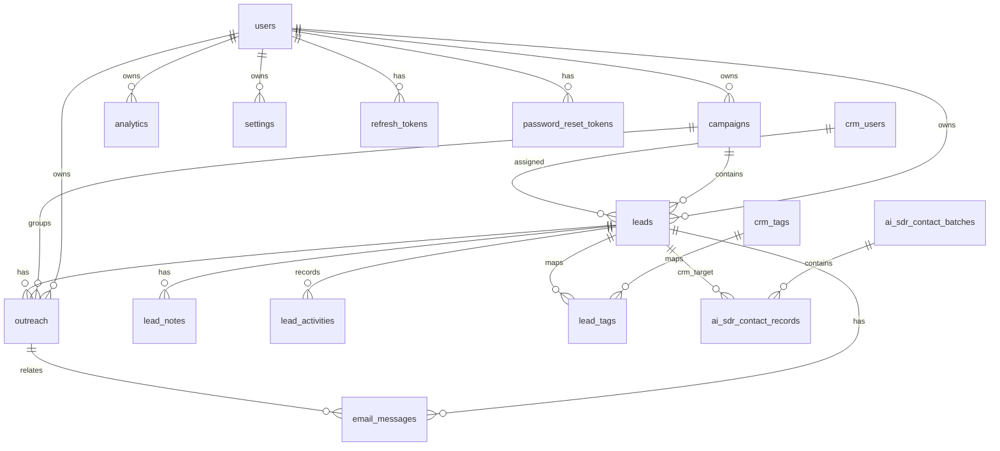

# Database Documentation

LeadForge uses PostgreSQL in production and SQLite in tests. SQLAlchemy models are in `backend/app/models.py` and `backend/ai_sdr/models.py`; Alembic migrations are in `backend/migrations/versions`.

## Entity Relationship Diagram

## Tables

All workspace-owned records include `user_id`. Queries must filter by the authenticated user's ID. LeadForge intentionally does not have organizations, teams, members, invitations, or shared workspaces.

### `users`

Application accounts.

Fields: `id`, `full_name`, `email`, `password_hash`, `provider`, `provider_id`, `avatar_url`, `is_admin`, `is_verified`, `created_at`, `updated_at`, `last_login`.
Constraint: unique `email`.

### `refresh_tokens`

Server-side refresh sessions.

Fields: `id`, `user_id`, `token_hash`, `user_agent`, `ip_address`, `expires_at`, `revoked_at`, `created_at`.
Constraint: unique `token_hash`.

### `password_reset_tokens`

Password reset token records.

Fields: `id`, `user_id`, `token_hash`, `expires_at`, `used_at`, `created_at`.
Constraint: unique `token_hash`.

### `campaigns`

Groups lead generation runs.

| Field | Purpose |
|---|---|
| `id` | UUID primary key. |
| `user_id` | Owning account. |
| `name` | Campaign name. |
| `city`, `state`, `country`, `continent` | Market geography. |
| `business_type` | Target industry/niche. |
| `status` | Draft/running/completed style lifecycle. |
| `max_leads` | Requested cap. |
| `leads_generated`, `emails_sent`, `replies` | Counters. |
| `created_at`, `updated_at` | Timestamps. |

Indexes: name, business_type, status.

### `crm_users`

Assignable CRM users.

Fields: `id`, `user_id`, `name`, `email`, `initials`, `is_active`, timestamps.
Constraint: unique `(user_id, email)`.

### `crm_tags`

Reusable CRM tags.

Fields: `id`, `user_id`, `name`, `color`, timestamps.
Constraint: unique `(user_id, name)`.

### `leads`

Central CRM account/contact table.

Fields include:

- Identity: `id`, `user_id`, `campaign_id`, `dedupe_key`
- Business: `business_name`, `business_type`, `website`, `google_maps_url`
- Contact: `contact_name`, `email`, `phone`
- Location: `location`, `city`, `state`, `country`
- AI analysis: `website_score`, `opportunity_score`, `website_problems`, `website_summary`, `improvement_suggestions`
- CRM lifecycle: `lead_status`, `crm_stage`, `outreach_status`, `assigned_user_id`, `last_contacted_at`, `next_follow_up_at`
- Metadata: `notes`, `tags`, `social_links`, `social_status`, `screenshot_url`, `source`, `raw`, timestamps

Constraint: unique `(user_id, dedupe_key)`.

### `lead_tags`

Many-to-many join table between leads and CRM tags.

Fields: `user_id`, `lead_id`, `tag_id`, `created_at`.
Primary key: `(lead_id, tag_id)`.

### `lead_notes`

User notes on CRM leads.

Fields: `id`, `user_id`, `lead_id`, `body`, `created_by`, timestamps.

### `lead_activities`

Immutable CRM activity timeline.

Fields: `id`, `user_id`, `lead_id`, `event_type`, `title`, `description`, `actor`, `metadata`, `created_at`.

### `outreach`

AI-generated outreach drafts and email lifecycle.

Fields:

- `id`, `user_id`, `lead_id`, `campaign_id`
- `subject_line`
- `personalized_first_line`
- `cold_email`
- `follow_up_1`
- `follow_up_2`
- `selected_version`
- `status`
- Gmail identifiers: `gmail_message_id`, `gmail_thread_id`, `tracking_id`
- Lifecycle timestamps: `sent_at`, `opened_at`, `replied_at`, `bounced_at`
- `failed_reason`, timestamps

### `email_messages`

Synced Gmail messages.

Fields: `id`, `user_id`, `lead_id`, `outreach_id`, `gmail_message_id`, `gmail_thread_id`, `message_id_header`, `direction`, `from_email`, `to_email`, `subject`, `body_text`, `body_html`, `snippet`, `message_at`, `created_at`.
Constraint: unique `(user_id, gmail_message_id)`.

### `analytics`

Platform event records.

Fields: `id`, `user_id`, `event_type`, `lead_id`, `campaign_id`, `metadata`, `created_at`.

### `settings`

Runtime settings overrides.

Fields: `user_id`, `key`, `value`, `is_secret`, `updated_at`.
Primary key: `(user_id, key)`.

### `lead_generation_jobs`

Background job tracking.

Fields: `id`, `user_id`, `campaign_id`, `status`, `city`, `state`, `country`, `continent`, `business_type`, `website_mode`, `max_leads`, `progress`, `lead_counter`, `success_counter`, `failure_counter`, `error`, `created_at`, `finished_at`.

### `ai_sdr_contact_batches`

AI SDR import batch metadata.

Fields: `id`, `user_id`, `source_type`, `status`, `total_count`, `normalized_count`, `stored_count`, `duplicate_count`, `failed_count`, `created_by`, `configuration`, `error`, timestamps.

Indexes: source/status.

### `ai_sdr_contact_records`

AI SDR per-contact import record.

Fields: `id`, `user_id`, `batch_id`, `crm_lead_id`, `source_type`, `external_id`, `status`, `dedupe_key`, `normalized`, `raw`, `errors`, timestamps.

Indexes: batch/status, CRM lead ID, source type, external ID, dedupe key.

## Relationships

- Campaigns own generated leads and outreach.
- Leads own CRM notes, activities, emails, outreach, tags, and AI SDR import records.
- Outreach can own Gmail message records.
- AI SDR import records point to CRM leads after normalization.

## Future Migrations

- Persistent conversation session tables.
- API token table.
- Billing/subscription tables.
- Job queue/task tables.
- Integration connection metadata.
