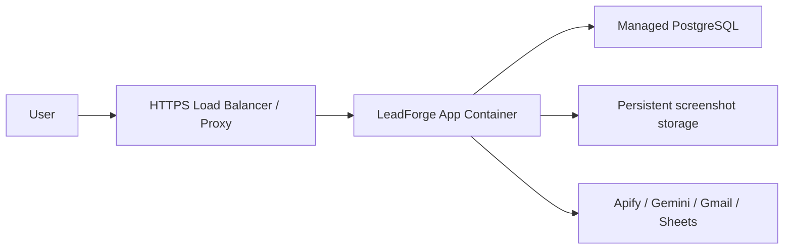

# Deployment Guide

## Local

Run backend and frontend separately:

```powershell
docker compose up -d postgres
cd backend
.\.venv\Scripts\Activate.ps1
python -m uvicorn app.main:app --reload --host 0.0.0.0 --port 8000
cd ..\frontend
npm run dev
```

## Docker

```powershell
docker compose up -d --build
```

Production container behavior:

1. Install backend dependencies.
2. Build/export frontend.
3. Copy frontend output into backend image.
4. Run Alembic migrations.
5. Start FastAPI.

## Railway

1. Create PostgreSQL service.
2. Deploy root Dockerfile.
3. Set `DATABASE_URL` or allow Compose-style generated URL via service.
4. Add Apify, Gemini, Gmail, and Google secrets.
5. Set `APP_URL`, `FRONTEND_ORIGIN`, and `PUBLIC_BACKEND_URL`.
6. Verify `/health/ready`.

## Netlify

Use Netlify when the frontend is hosted separately:

- Build command: `npm run build` from `frontend`.
- Publish static output.
- Set `NEXT_PUBLIC_API_URL` to the FastAPI URL.
- Configure backend `FRONTEND_ORIGIN` to Netlify domain.

## Production

Recommended architecture:



## Scaling

Current:

- One API process.
- One DB.
- In-process background jobs and SSE state.

Future:

- Queue-backed workers.
- Shared event bus.
- Object storage.
- Horizontal API replicas.
- Read replica for analytics.

## Monitoring

Minimum:

- `/health/live`
- `/health/ready`
- Application logs.
- Database CPU/storage.
- Integration failure counts.

Recommended:

- Error tracking.
- Metrics dashboard.
- Alerting on failed jobs, Gmail failures, and DB readiness failures.

## Backups

PostgreSQL dump:

```bash
docker compose exec -T postgres pg_dump -U leadgen -d leadgen -Fc > leadforge.dump
```

Back up:

- PostgreSQL.
- Screenshot volume.
- Environment configuration.
- OAuth credential metadata.

## Disaster Recovery

1. Provision new database.
2. Restore latest dump.
3. Deploy app image.
4. Reapply secrets.
5. Run migrations.
6. Verify health endpoints.
7. Run smoke tests: dashboard, generation, CRM, send email, AI SDR.
