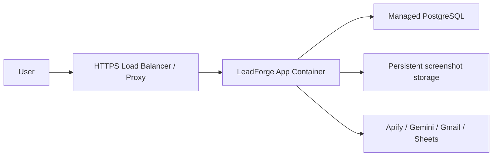

# Deployment Guide

## Local

Run backend and frontend separately:

```powershell
docker compose up -d postgres
cd backend
.\.venv\Scripts\Activate.ps1
python -m uvicorn app.main:app --reload --host 0.0.0.0 --port 8000
cd ..\frontend
npm run dev
```

## Docker

```powershell
docker compose up -d --build
```

Production container behavior:

1. Install backend dependencies.
2. Build/export frontend.
3. Copy frontend output into backend image.
4. Run Alembic migrations.
5. Start FastAPI.

## Railway

1. Create PostgreSQL service.
2. Deploy from the repository root. `railway.json` pins the build to the root `Dockerfile`, which builds the static Next.js frontend and serves it from FastAPI.
3. Do not set the Railway root directory to `backend` or `frontend` for the combined production app. Those Dockerfiles are for split deployments.
4. Set `DATABASE_URL` from the Railway PostgreSQL service.
5. Add Apify, Gemini, Gmail OAuth client, Google login, and AI SDR provider secrets.
6. Set `APP_URL`, `FRONTEND_ORIGIN`, and `PUBLIC_URL` to the public Railway app URL.
7. Leave `NEXT_PUBLIC_API_URL` empty for the combined container so the browser calls the same origin.
8. Add `https://<your-railway-domain>/gmail/callback` to the Gmail OAuth client's authorized redirect URIs.
9. Add `https://<your-railway-domain>/ai-sdr/calls/twilio/voice` and `https://<your-railway-domain>/ai-sdr/calls/manual-bridge/voice` as Twilio webhook URLs only if you configure them manually. User-initiated outbound calls set callback URLs automatically.
10. Verify `/health/ready`, `/ai-sdr/health`, `/ai-sdr/`, `/ai-sdr/call/`, Settings -> Email Integration, and Settings -> Voice.

The root Docker build checks for `out/ai-sdr/index.html` and `out/ai-sdr/call/index.html`. If the AI SDR pages are not exported, the production image fails during build instead of deploying without the module.

### AI SDR Railway Variables

Use these values for the combined Railway web service:

```dotenv
AI_SDR_ENABLED=true
AI_SDR_API_PREFIX=/ai-sdr
AI_SDR_CALLING_ENABLED=true
AI_SDR_CALLING_MODE=production
AI_SDR_TELEPHONY_PROVIDER=twilio
AI_SDR_LLM_PROVIDER=gemini
AI_SDR_SPEECH_PROVIDER=cartesia
AI_SDR_CALL_FROM_NUMBER=
AI_SDR_PUBLIC_WEBSOCKET_URL=wss://<your-railway-domain>
PUBLIC_URL=https://<your-railway-domain>
FRONTEND_ORIGIN=https://<your-railway-domain>
NEXT_PUBLIC_API_URL=
TWILIO_ACCOUNT_SID=
TWILIO_AUTH_TOKEN=
TWILIO_VALIDATE_SIGNATURE=true
GEMINI_API_KEY=<your Gemini API key>
AI_SDR_GEMINI_MODEL=gemini-2.5-flash
CARTESIA_API_KEY=
CARTESIA_VOICE_ID=
CARTESIA_LANGUAGE=en
CARTESIA_TTS_SPEED=normal
CARTESIA_VERSION=2026-03-01
CARTESIA_TTS_MODEL=sonic-3.5
CARTESIA_STT_MODEL=ink-whisper
CARTESIA_TTS_ENCODING=pcm_mulaw
CARTESIA_STT_ENCODING=pcm_mulaw
CARTESIA_TTS_SAMPLE_RATE=8000
CARTESIA_STT_SAMPLE_RATE=8000
```

`TWILIO_ACCOUNT_SID`, `TWILIO_AUTH_TOKEN`, `AI_SDR_CALL_FROM_NUMBER`, `CARTESIA_API_KEY`, and `CARTESIA_VOICE_ID` are legacy/dev fallbacks. In production, each signed-in user connects their own Twilio account and voice preferences from **Settings -> Voice**. The app encrypts each user's Twilio auth token and Cartesia API key in PostgreSQL, then uses those credentials for outbound AI SDR calls and matching Twilio webhook validation. Keep `TWILIO_VALIDATE_SIGNATURE=true` on Railway.

## Netlify

Use Netlify when the frontend is hosted separately:

- Build command: `npm run build` from `frontend`.
- Publish static output.
- Set `NEXT_PUBLIC_API_URL` to the FastAPI URL.
- Configure backend `FRONTEND_ORIGIN` to Netlify domain.

The frontend-only Dockerfile also serves the exported `out/` directory through nginx. When using that image, set the build argument `NEXT_PUBLIC_API_URL` to the public FastAPI URL.

## Production

Recommended architecture:



## Scaling

Current:

- One API process.
- One DB.
- In-process background jobs and SSE state.

Future:

- Queue-backed workers.
- Shared event bus.
- Object storage.
- Horizontal API replicas.
- Read replica for analytics.

## Monitoring

Minimum:

- `/health/live`
- `/health/ready`
- Application logs.
- Database CPU/storage.
- Integration failure counts.

Recommended:

- Error tracking.
- Metrics dashboard.
- Alerting on failed jobs, Gmail failures, and DB readiness failures.

## Backups

PostgreSQL dump:

```bash
docker compose exec -T postgres pg_dump -U leadgen -d leadgen -Fc > leadforge.dump
```

Back up:

- PostgreSQL.
- Screenshot volume.
- Environment configuration.
- OAuth credential metadata.

## Disaster Recovery

1. Provision new database.
2. Restore latest dump.
3. Deploy app image.
4. Reapply secrets.
5. Run migrations.
6. Verify health endpoints.
7. Run smoke tests: dashboard, generation, CRM, send email, AI SDR.
