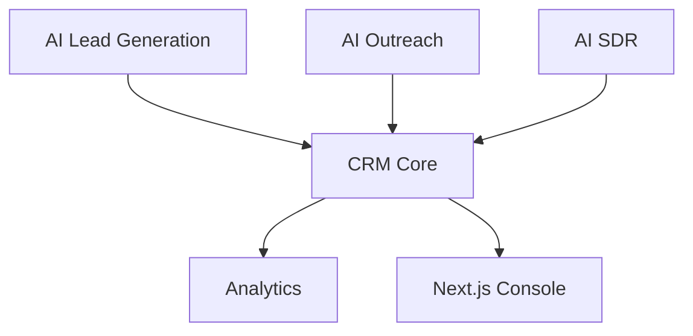

# Hackathon Submission Guide

## Problem

Sales teams waste hours moving between prospecting tools, spreadsheets, CRMs, email clients, and AI assistants. The work is repetitive, context is lost, and follow-up quality suffers.

## Innovation

LeadForge combines AI lead discovery, CRM, outreach, analytics, and an independent AI SDR architecture in one operational platform. It does not just generate text; it turns AI output into structured CRM workflows.

## Technology

- FastAPI backend.
- Next.js frontend.
- PostgreSQL database.
- Gemini AI.
- Apify crawling.
- Gmail and Google Sheets APIs.
- AI SDR state-machine conversation engine.
- Docker deployment.

## AI Components

- Website analysis.
- Opportunity scoring.
- Outreach drafting.
- AI SDR conversation memory.
- Objection detection.
- Qualification scoring.
- Mock calling workspace AI Brain.

## Business Value

LeadForge helps teams:

- Build pipeline faster.
- Personalize outreach with real context.
- Centralize CRM operations.
- Reduce manual follow-up.
- Prepare for AI SDR voice workflows.

## Scalability

The current modular monolith can be deployed quickly. Its boundaries support future extraction into workers/services for lead generation, email sync, AI SDR, and analytics.

## Future Vision

LeadForge becomes an AI revenue operating system with:

- Multi-tenant SaaS accounts.
- Voice AI SDR.
- Calendar booking.
- Billing.
- CRM integrations.
- Advanced analytics.

## Demo Guide

1. Open dashboard.
2. Start a lead generation job.
3. Show live progress.
4. Open generated lead in CRM.
5. Review website analysis and outreach draft.
6. Show CRM activity and Gmail sync concepts.
7. Open AI SDR dashboard.
8. Open AI Calling Workspace.
9. Demonstrate mock transcript and AI Brain.
10. Call AI SDR conversation API and ask "Are you AI?" to show honest disclosure.

## Architecture

## Why It Should Win

LeadForge demonstrates a complete product vision, not a thin AI wrapper. It combines real integrations, database architecture, AI workflows, CRM operations, frontend polish, deployment readiness, and a future-ready AI SDR engine.

## Impact

LeadForge can help small teams compete with larger sales organizations by automating research, improving personalization, and making follow-up more consistent.
