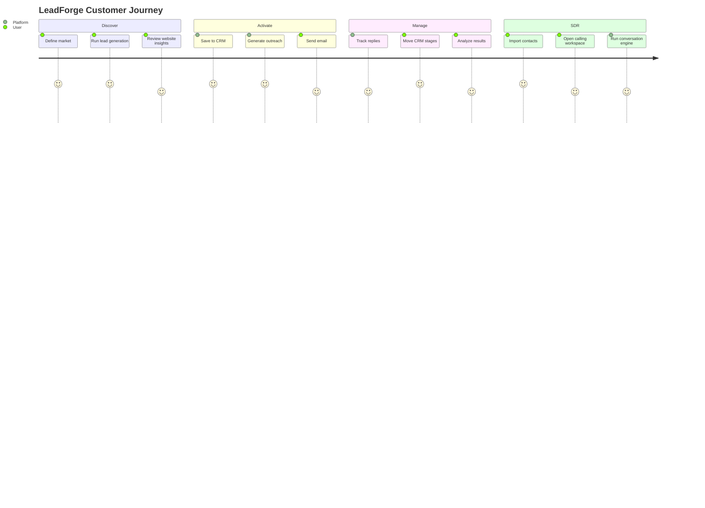

# Product Documentation

## Business Vision

LeadForge AI is the AI-native revenue operations platform for small and mid-market teams that need to find prospects, qualify opportunities, manage pipeline, and act quickly without stitching together multiple disconnected tools.

## Target Customers

- Local service agencies.
- B2B growth teams.
- Fractional SDR agencies.
- Consultants selling website/automation services.
- SMB sales teams.
- Hackathon judges evaluating applied AI products.

## Competitive Advantage

| Advantage | Why It Matters |
|---|---|
| End-to-end workflow | Discovery, CRM, outreach, analytics, and AI SDR in one platform. |
| CRM-centered design | Every workflow enriches a shared source of truth. |
| AI with context | Website analysis and outreach use business-specific data. |
| Independent AI SDR | Contact ingestion and conversation architecture are not tied to lead generation. |
| Deployment-ready | Docker, migrations, health checks, and environment docs exist. |

## Pricing Model

Potential SaaS tiers:

- Starter: limited lead generation, CRM, manual AI SDR imports.
- Growth: higher generation limits, Gmail automation, AI outreach, exports.
- Agency: higher private-workspace limits, bulk AI SDR imports, analytics.
- Enterprise: SSO, audit logs, custom integrations, dedicated support.

## Future SaaS Plans

- Private SaaS accounts.
- Billing and subscriptions.
- Voice calling integration.
- Shared inbox.
- Calendar scheduling.
- Marketplace integrations.
- Usage and cost dashboards.

## Use Cases

- Find dentists in Austin with weak mobile booking flows.
- Generate outreach for businesses with website conversion gaps.
- Track replies and CRM stages from Gmail.
- Import a CSV of contacts into AI SDR and normalize into CRM.
- Simulate AI SDR calls using mock events and structured conversation memory.

## Customer Journey

