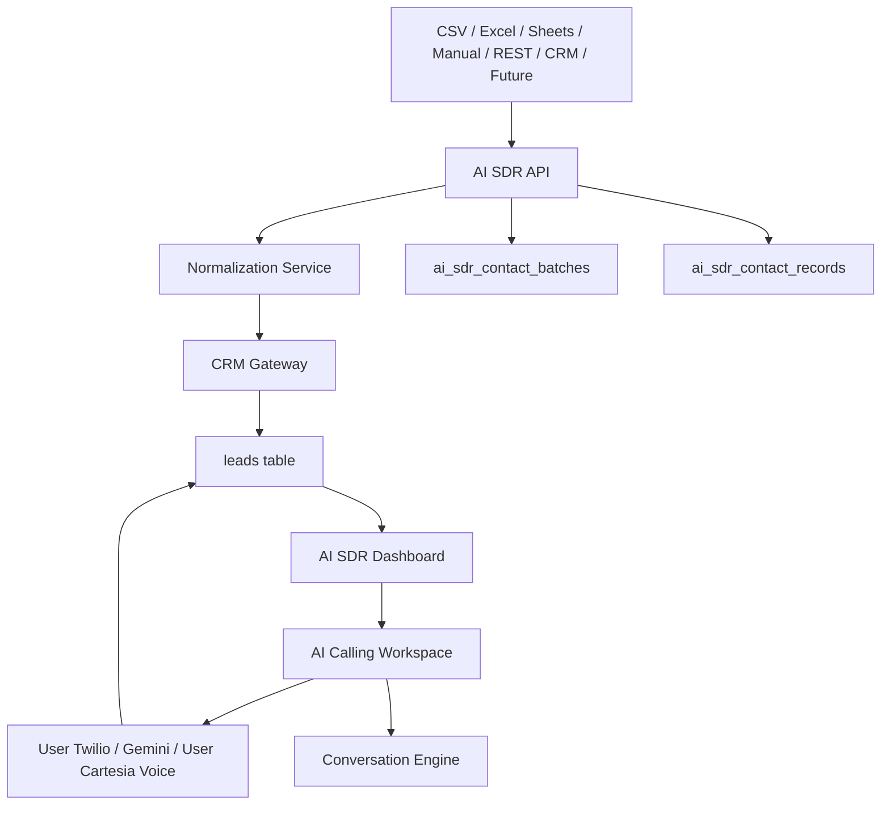

# AI SDR Module

## Purpose

AI SDR is an independent module for sales-development workflows. It does not depend on the Lead Generator module. It receives contacts from multiple sources, normalizes them into CRM, provides a dashboard, opens an AI Calling Workspace, runs a conversation engine, and integrates a provider-based production calling stack.

## Responsibilities

- Own AI SDR routes, services, schemas, config, models, UI, API client, and docs.
- Ingest contacts from CSV, Excel, Google Sheets, Manual Entry, REST API, CRM, and future integrations.
- Normalize every contact.
- Store normalized contacts in CRM.
- Track import batches and records.
- Provide dashboard metrics, filters, table, profile, bulk delete, and export.
- Provide production calling through Twilio, Gemini, and Cartesia provider interfaces.
- Use each signed-in user's connected Twilio account and preferred Cartesia voice settings for AI SDR calls.
- Store call transcripts and outcomes in CRM.
- Maintain conversation memory and structured events.

## Architecture



## Workflow

1. Contact source submits raw records.
2. `AISDRIngestionService` creates a batch.
3. `normalize_contact` maps fields.
4. `AISDRCRMGateway` upserts into CRM.
5. `AISDRDashboardService` returns metrics and contact rows.
6. Frontend opens `/ai-sdr`.
7. User clicks Call and opens `/ai-sdr/call?contactId=<id>`.
8. Production call sessions stream transcript and AI Brain state from the backend when the user has connected Twilio and voice settings are configured.
9. Mock fallback remains available for local provider-free demos.
10. Conversation engine can start or continue sessions through `/ai-sdr/conversations`.

## Folder Structure

```text
backend/ai_sdr/
  api/router.py
  config.py
  models.py
  schemas.py
  services/
  infrastructure/crm_gateway.py
  conversation/
  calling/
frontend/ai_sdr/
  api.ts
  types.ts
  components/
frontend/src/app/ai-sdr/
```

## APIs

| Method | Route | Purpose |
|---|---|---|
| GET | `/ai-sdr/health` | Module health. |
| GET | `/ai-sdr/sources` | Supported sources. |
| POST | `/ai-sdr/imports` | Generic import. |
| GET | `/ai-sdr/imports` | List imports. |
| GET | `/ai-sdr/imports/{batch_id}` | Import detail. |
| POST | `/ai-sdr/contacts/manual` | Manual entry. |
| POST | `/ai-sdr/contacts` | REST API contacts. |
| GET | `/ai-sdr/dashboard` | Dashboard data. |
| GET | `/ai-sdr/contacts/{contact_id}` | Contact profile. |
| POST | `/ai-sdr/contacts/bulk-delete` | Archive contacts. |
| POST | `/ai-sdr/contacts/export.csv` | Export CSV. |
| GET | `/ai-sdr/conversation/states` | State list. |
| POST | `/ai-sdr/conversations` | Start session. |
| GET | `/ai-sdr/conversations/{session_id}` | Get session. |
| POST | `/ai-sdr/conversations/{session_id}/turn` | Add customer turn. |
| POST | `/ai-sdr/calls/outbound` | Start an outbound AI SDR call. |
| GET | `/ai-sdr/calls` | List process-local call sessions. |
| GET | `/ai-sdr/calls/{call_id}` | Read live call state. |
| POST | `/ai-sdr/calls/{call_id}/control` | Mute, pause/resume AI, transfer, hang up, or summarize. |
| POST | `/ai-sdr/calls/{call_id}/transcript` | Testing hook for transcript injection. |
| POST | `/ai-sdr/calls/{call_id}/complete` | Complete and store call outcome. |
| GET/POST | `/ai-sdr/calls/twilio/voice` | Twilio TwiML callback. |
| POST | `/ai-sdr/calls/twilio/status` | Twilio status callback. |
| WS | `/ai-sdr/calls/twilio/media` | Twilio Media Streams socket. |

## Twilio and Voice Settings

Each user connects one active Twilio account from **Settings -> Voice**. The backend validates the account SID and auth token with Twilio, requires or auto-selects one Twilio phone number, encrypts the auth token, and stores the connection on that user's account. AI SDR calls started by that user always use that user's Twilio credentials and selected caller ID.

Voice settings are also stored per user. The current provider is Cartesia, with configurable voice ID, voice label, language, speaking speed, business name, assistant name, AI greeting, and an optional encrypted Cartesia API key. If a user leaves a voice field empty, the AI SDR runtime falls back to deployment defaults.

## Database Tables

- `ai_sdr_contact_batches`
- `ai_sdr_contact_records`
- shared CRM `leads`
- shared CRM `lead_activities`

## Services

- `AISDRIngestionService`
- `AISDRDashboardService`
- `AISDRCRMGateway`
- `normalize_contact`
- `AISDRConversationManager`
- `ConversationMemoryManager`
- `SalesStrategy`
- `ObjectionHandler`
- `QualificationEngine`
- `ClosingStrategy`
- `AISDRCallingOrchestrator`
- `TelephonyProvider`
- `LLMProvider`
- `SpeechProvider`

## Future Improvements

- Persistent conversation sessions.
- Persistent distributed call-session storage for multi-worker deployments.
- AI model-backed conversation generation.
- CRM-to-AI SDR campaign creation.
- More source-specific adapters.
