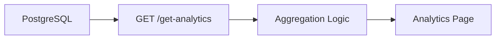

# Analytics Module

## Purpose

Analytics gives operators visibility into generation volume, outreach performance, website opportunity, and recent activity.

## Responsibilities

- Count latest and all-time leads.
- Track generated, saved, failed, emailed, opened, and replied leads.
- Compute open and conversion rates.
- Aggregate daily generation and email activity.
- Surface top cities and business types.
- Display recent platform activity.

## Architecture



## Workflow

1. Frontend loads `/analytics`.
2. API queries leads, outreach, jobs, and analytics rows.
3. Backend computes summarized metrics.
4. UI renders cards, charts, and activity summaries.

## Folder Structure

```text
backend/app/main.py
backend/app/models.py
frontend/src/app/analytics/page.tsx
frontend/src/components/chart-panel.tsx
frontend/src/components/metric-card.tsx
```

## APIs

| Method | Route | Purpose |
|---|---|---|
| GET | `/get-analytics` | Return platform analytics summary. |

## Database Tables

- `analytics`
- `leads`
- `outreach`
- `lead_generation_jobs`

## Services

Analytics is currently route-level aggregation in `backend/app/main.py`. This is acceptable for the current product size and should move into a dedicated service if reporting grows.

## Future Improvements

- Dedicated analytics service layer.
- Materialized views for large data volumes.
- Funnel reporting.
- Time-range filters.
- Source attribution dashboards.
