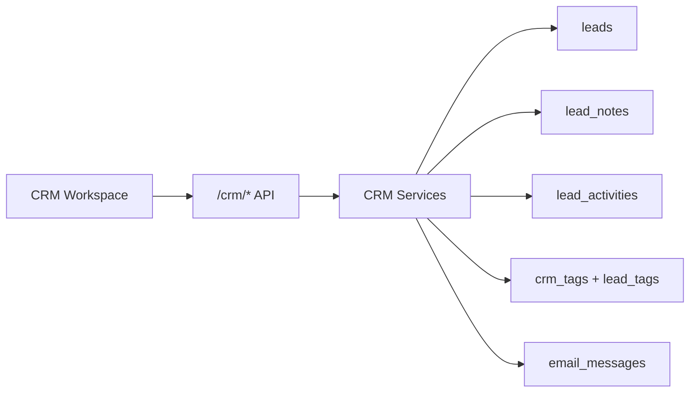

# CRM Module

## Purpose

CRM is the central operating system for LeadForge. Every lead discovered by automation or imported by AI SDR is normalized into CRM so teams have one source of truth.

## Responsibilities

- Store account/contact data in `leads`.
- Manage CRM stages.
- Assign users.
- Track tags, notes, and activity.
- Surface Gmail message history.
- Power kanban and table views.
- Provide APIs consumed by the frontend CRM workspace.

## Architecture



## Workflow

1. User opens `/crm`.
2. Frontend requests `/crm/leads`.
3. Backend returns list items, totals, and stage counts.
4. User opens a lead detail sheet.
5. Backend returns CRM profile, outreach history, notes, activities, and emails.
6. Updates create audit activity records.

## Folder Structure

```text
backend/app/crm.py
backend/app/services/crm.py
frontend/src/components/crm/
frontend/src/app/crm/page.tsx
```

## APIs

| Method | Route | Purpose |
|---|---|---|
| GET | `/crm/leads` | List CRM leads with filters. |
| GET | `/crm/leads/{lead_id}` | Get CRM detail profile. |
| PATCH | `/crm/leads/{lead_id}` | Update CRM lead fields. |
| POST | `/crm/leads/{lead_id}/notes` | Add note. |
| PUT | `/crm/leads/{lead_id}/tags` | Replace tags. |
| POST | `/crm/leads/{lead_id}/sync-gmail` | Sync Gmail thread for a lead. |
| GET | `/crm/users` | List CRM users. |
| POST | `/crm/users` | Create CRM user. |

## Database Tables

- `leads`
- `crm_users`
- `crm_tags`
- `lead_tags`
- `lead_notes`
- `lead_activities`
- `email_messages`
- `outreach`

## Services

- `change_crm_stage`
- `record_crm_activity`
- `replace_lead_tags`
- `mark_contacted`

## Future Improvements

- Multi-user authentication.
- Role-based permissions.
- CRM import/export UI.
- Saved views and custom fields.
- SLA reminders and calendar scheduling.
