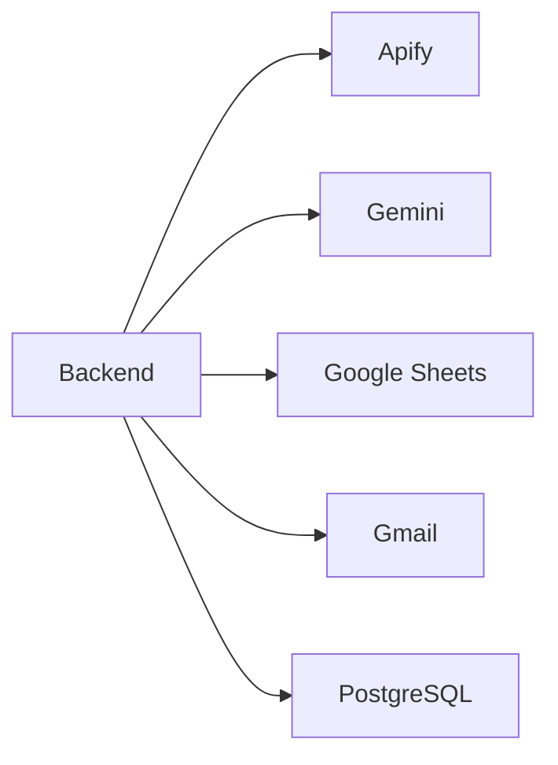

# Integrations Module

## Purpose

Integrations connect LeadForge to external systems for discovery, AI, storage, and communication.

## Responsibilities

- Apify business and website crawling.
- Gemini AI analysis and drafting.
- Google Sheets validation and sync.
- Gmail OAuth sending and reply sync.
- PostgreSQL persistence.
- Future source adapters for AI SDR.

## Architecture



## Workflow

Integrations are called by services, not directly from the frontend. Credentials are read from environment variables or settings overrides and never exposed to browser code.

## Folder Structure

```text
backend/app/gmail.py
backend/app/google_sheets.py
backend/app/ai.py
backend/lead_automation/apify_maps.py
backend/lead_automation/apify_web.py
backend/lead_automation/sheets.py
```

## APIs

| Integration | API Surface |
|---|---|
| Google Sheets | `GET /health/google` plus generation sync |
| Gmail | `/send-email`, `/send-email/sync-statuses`, `/crm/leads/{id}/sync-gmail` |
| Gemini | Internal service calls during analysis/outreach |
| Apify | Internal service calls during generation |

## Database Tables

- `settings`
- `email_messages`
- `outreach`
- `leads`
- `analytics`

## Future Improvements

- Integration health dashboard.
- OAuth setup wizard.
- Webhook ingestion.
- Provider abstraction layer.
- Per-integration retry queue.
