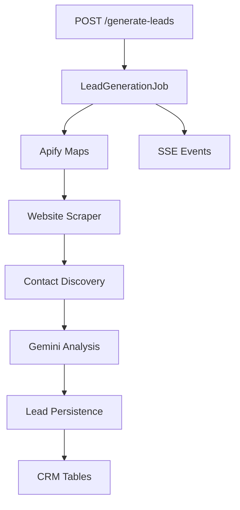

# Lead Generator Module

## Purpose

The Lead Generator turns market criteria into qualified CRM records. It is the discovery engine for LeadForge: given location, business type, website mode, and volume, it finds businesses, enriches their websites/contact data, analyzes opportunity, drafts outreach, and persists results.

## Responsibilities

- Accept lead-generation criteria from the frontend.
- Create and track generation jobs.
- Fetch businesses from Apify Google Maps.
- Scrape websites and discover contacts.
- Analyze websites with Gemini.
- Generate outreach drafts.
- Persist leads, campaigns, outreach, activities, and analytics.
- Stream job progress through server-sent events.

## Architecture



## Workflow

1. Frontend calls `POST /generate-leads`.
2. Backend creates an in-memory job and a database job row.
3. Background runner executes source discovery and enrichment.
4. Lead persistence upserts database records.
5. Frontend subscribes to `/generate-leads/{job_id}/events`.

## Folder Structure

```text
backend/lead_automation/
  apify_maps.py
  apify_web.py
  website_scraper.py
  contact_discovery.py
  ai_extractor.py
  confidence.py
  validation.py
  sheets.py
  models.py
backend/app/
  runner.py
  job_state.py
  services/lead_pipeline.py
  services/lead_persistence.py
  services/lead_analysis.py
  services/contact_enrichment.py
```

## APIs

| Method | Route | Purpose |
|---|---|---|
| POST | `/generate-leads` | Start generation job. |
| GET | `/generate-leads/latest` | Read latest job snapshot. |
| GET | `/generate-leads/{job_id}` | Read a specific job snapshot. |
| GET | `/generate-leads/{job_id}/events` | Stream job progress via SSE. |
| GET | `/get-leads` | List generated leads. |
| PATCH | `/get-leads/{lead_id}` | Update lead fields. |
| GET | `/get-leads/export.csv` | Export leads. |

## Database Tables

- `lead_generation_jobs`
- `campaigns`
- `leads`
- `outreach`
- `analytics`
- `lead_activities`

## Services

- `create_generation_job`
- `run_generation_job`
- `LeadPipelineService`
- `LeadPersistenceService`
- `LeadAnalysisService`
- `ContactEnrichmentService`

## Future Improvements

- External worker queue.
- Retry orchestration per enrichment step.
- Per-source usage/cost tracking.
- Duplicate detection dashboard.
- Better source adapter abstraction for non-Apify providers.
