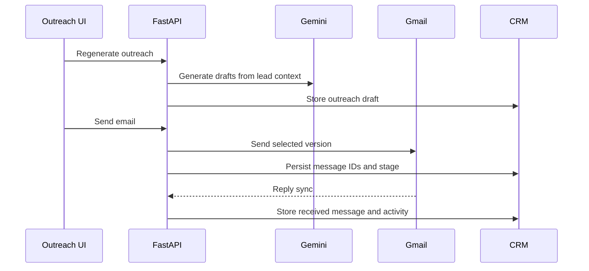

# Outreach Module

## Purpose

Outreach turns qualified leads into personalized email conversations. It combines AI-generated copy with Gmail sending, tracking, and reply synchronization.

## Responsibilities

- Store cold email and follow-up drafts.
- Regenerate AI outreach from lead context.
- Send selected versions through Gmail.
- Track opens with a pixel endpoint.
- Sync replies and Gmail thread history.
- Advance CRM stages based on email activity.

## Architecture



## Workflow

1. Outreach drafts are created during lead generation.
2. User reviews or regenerates a draft.
3. User sends one selected version.
4. Gmail message/thread IDs are stored.
5. Pixel opens and reply sync update lead state.

## Folder Structure

```text
backend/app/main.py
backend/app/gmail.py
backend/app/email_sync.py
backend/app/services/lead_analysis.py
frontend/src/app/outreach/page.tsx
```

## APIs

| Method | Route | Purpose |
|---|---|---|
| GET | `/outreach` | List outreach drafts. |
| POST | `/outreach/{lead_id}/regenerate` | Regenerate AI outreach. |
| POST | `/send-email` | Send selected outreach version. |
| POST | `/send-email/sync-statuses` | Sync Gmail replies. |
| GET | `/email/open/{tracking_id}.png` | Track email opens. |

## Database Tables

- `outreach`
- `email_messages`
- `leads`
- `lead_activities`
- `analytics`

## Services

- `GmailClient`
- `sync_replied_outreach`
- `LeadAnalysisService`

## Future Improvements

- Sequenced campaigns.
- A/B testing.
- Calendar booking links.
- Bounce handling and suppression lists.
- Deliverability dashboards.
