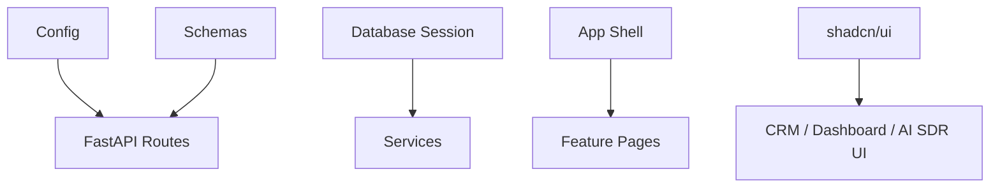

# Shared Platform Module

## Purpose

Shared code provides the platform foundation: database, configuration, schemas, settings, UI primitives, formatting helpers, and application shell.

## Responsibilities

- Database engine/session lifecycle.
- Global configuration.
- Pydantic schemas.
- Runtime settings store.
- Shared frontend API client.
- Shared UI components and layout.
- App navigation.

## Architecture



## Folder Structure

```text
backend/app/config.py
backend/app/database.py
backend/app/schemas.py
backend/app/settings_store.py
frontend/src/lib/
frontend/src/components/ui/
frontend/src/components/app-shell.tsx
frontend/src/app/layout.tsx
```

## APIs

Shared APIs include health and settings:

| Method | Route | Purpose |
|---|---|---|
| GET | `/health` | Liveness. |
| GET | `/health/live` | Liveness. |
| GET | `/health/ready` | Database readiness. |
| GET | `/settings` | Runtime settings summary. |
| PUT | `/settings` | Save runtime settings. |

## Database Tables

- `settings`

## Services

- `get_settings`
- `get_db`
- `effective_settings`
- shared frontend `request<T>()` helpers

## Future Improvements

- Formal dependency injection container.
- Per-account settings metadata.
- Shared audit/event bus.
- API client code generation from OpenAPI.
